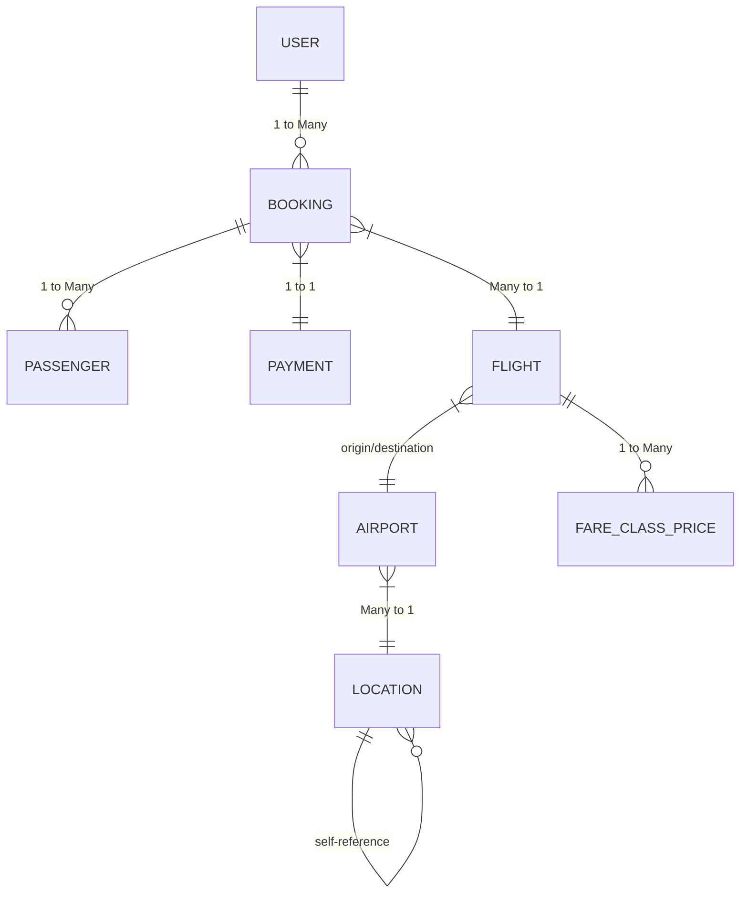

# Air Ticketing System

A comprehensive Spring Boot-based Airline Ticketing System that manages flights, bookings, passengers, and payments.

## 🚀 Features

- **Flight Management**: Create, update, and manage flight schedules
- **Booking System**: Handle flight bookings with multiple passengers
- **Passenger Management**: Store and manage passenger information
- **Payment Processing**: Secure payment handling with multiple methods
- **User Management**: Role-based access control (Admin, Staff, Customer)
- **Airport & Location Management**: Comprehensive location hierarchy

## 🛠️ Tech Stack

- **Backend**: Java 17, Spring Boot 3.5.7
- **Database**: PostgreSQL
- **ORM**: Hibernate 6.6.33
- **Build Tool**: Maven
- **API Documentation**: SpringDoc OpenAPI

## 📋 Entity Relationship Diagram (ERD)



## 🏗️ Project Structure

```
src/main/java/com/Airlink/AirticketingSystem/
├── config/           # Configuration classes
├── controller/       # REST controllers
├── dto/              # Data Transfer Objects
├── exception/        # Exception handling
├── model/            # JPA entities
│   ├── enums/        # Enumerations
│   └── *Entity.java  # Entity classes
├── repository/       # JPA repositories
├── service/          # Business logic
└── AirticketingSystemApplication.java
```

## 🚀 Getting Started

### Prerequisites
- Java 17 or higher
- Maven 3.6+
- PostgreSQL 13+

### Installation
1. Clone the repository
2. Configure database in `application.properties`
3. Build the project:
   ```bash
   mvn clean install
   ```
4. Run the application:
   ```bash
   mvn spring-boot:run
   ```

## 🌐 API Endpoints

- **Users**: `/api/users`
- **Flights**: `/api/flights`
- **Bookings**: `/api/bookings`
- **Passengers**: `/api/passengers`
- **Payments**: `/api/payments`
- **Airports**: `/api/airports`

## 📝 License

This project is licensed under the MIT License - see the [LICENSE](LICENSE) file for details.

## 👥 Contributors

- [Your Name] - Initial work

---

<div align="center">
  Made with ❤️ for Airline Management
</div>
